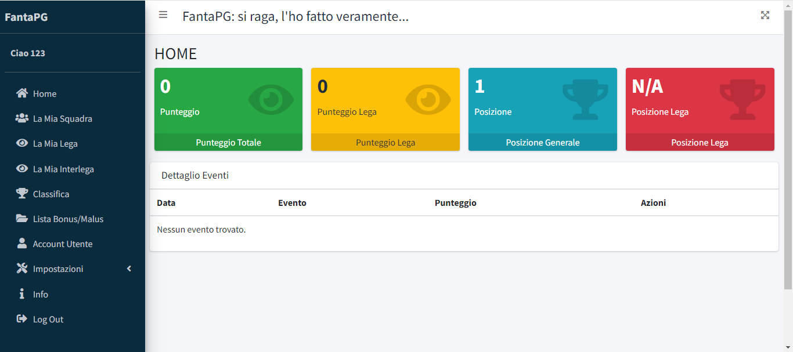
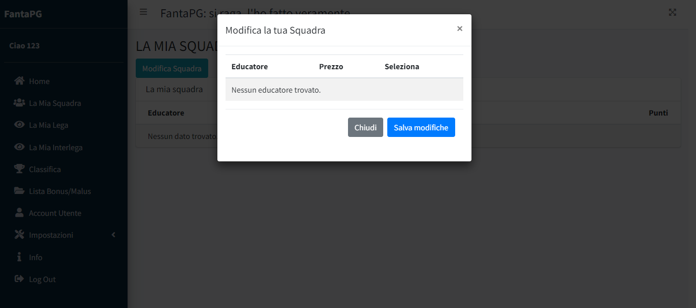
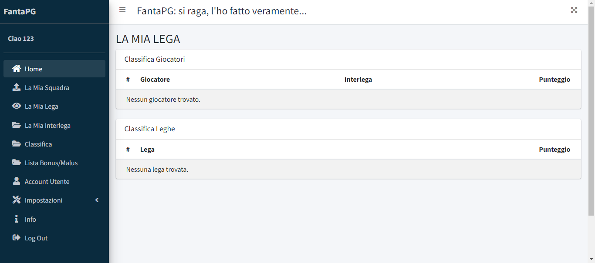
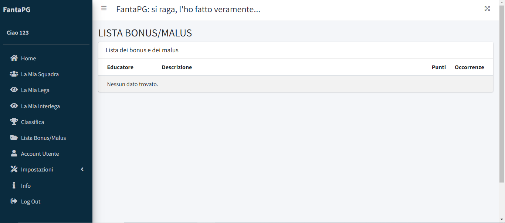
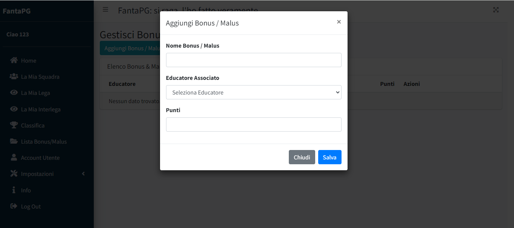
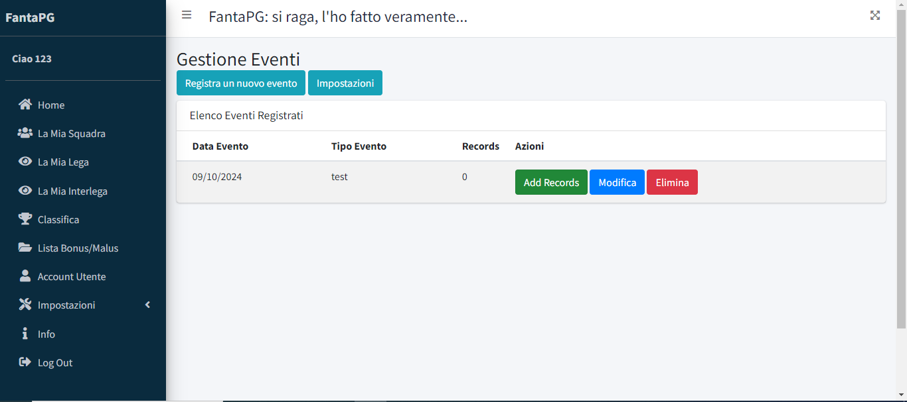
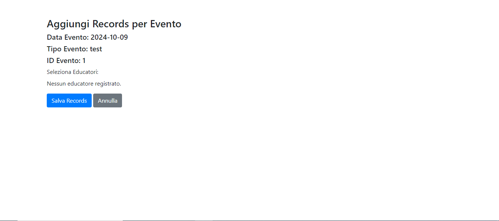

# FantaSito

Il presente applicativo è nato per gestire automaticamente un Fantagioco. Il tutto è altamente personalizzabile.
L'utilizzo è vincolato alla richiesta di un machine code e chiave di attivazione mediante una issue su GitHub.

### Installazione

L'installazione non è automatica. E' necessario seguire i passaggi:

1. Registrarsi ad un host web per ottenere uno spazio internet;
2. Caricare tramite FTP i file presenti in "release", in base alla versione;
3. Aprire PHPMYADMIN, e caricare il file fantasito.sql, che contiene la configurazione del database.
4. Al primo avvio, inserire la chiave di attivazione e chiave macchina ricevute;
5. Fare login con user e password "123";
6. Creare tutti gli account necessari ed ELIMINARE l'account di default.

### Aggiungi Lega / Interlega

Per limite software, deve essere fatto dagli admin, e non dai singoli giocatori.
I giocatori possono comunque aggiornare la propria squadra, se consentito dagli admin.

### Logging eventi

Per registrare gli avvenimenti, devi prima configurare il giorno. 
Recardi in "Gestisci Eventi", Registra, e compilare tutti i campi. Poi, premi "add record".

### Schermate

La prima schermata. Mostra,in ordine discendente cronologico, tutti gli "eventi" che possono dar luogo a 
bonus o malus. In alto, per una rapida visione, si possono vedere il punteggio e la posizione
propria e della propria lega

Consente di modificare la propria squadra (se consentito) e di vedere ciascun educatore quanti punti
ha ottenuto.

Consente di vedere la propria lega / interlega. Per limiti software, la lega / interlega
deve essere generata dagli admin.

Consente di vedere i bonus ed i malus, con le relative occorrenze.

Consente di aggiungere un bonus o un malus associata ad un dato educatore.

Consente di inserire gli eventi che possono dar luogo a bonus e malus.

Consente di registrare un bonus o malus ad un dato evento.